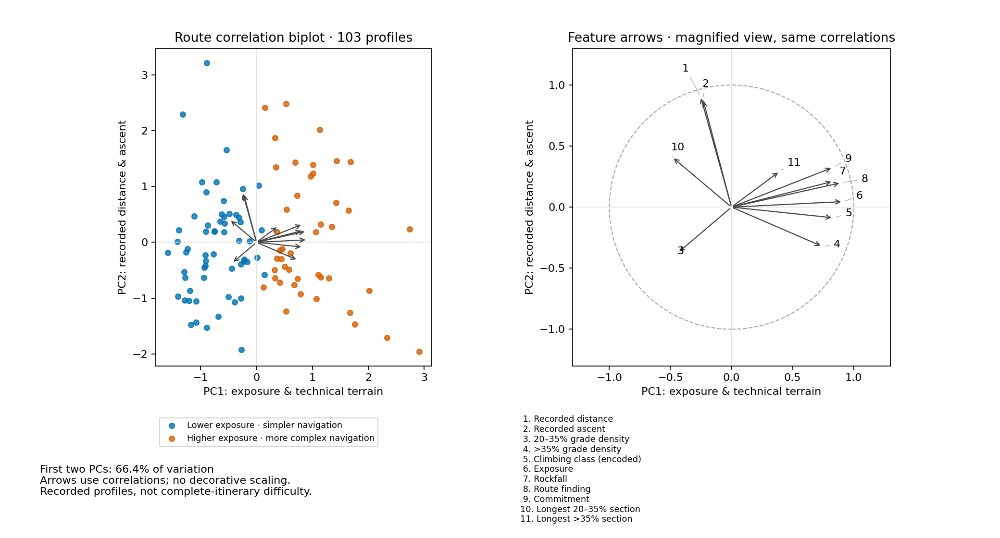

# Colorado 14er Route Explorer

Explore and compare routes on Colorado’s fourteeners—mountains over 14,000 feet—using climbing ratings, terrain profiles and community experience.

**[Open the Route Explorer](https://fortunate-peak-path-pilot.base44.app/)** · [Explore route similarity](https://fortunate-peak-path-pilot.base44.app/embeddings) · [Contribute a comparison](https://fortunate-peak-path-pilot.base44.app/vote)

The project brings route information and data science together to help people understand how climbs differ: how technical they are, how much exposure they involve, and how long their steep sections last. The catalog includes standard routes, alternatives and multi-summit traverses. It is growing and does not include every possible 14er itinerary.

## What you can explore

- **Routes:** browse by peak, climbing class and exposure, then open a route for its measurements and source description.
- **Similar profiles:** explore PCA, UMAP and t-SNE charts showing relationships among routes with comparable recorded attributes.
- **Provisional difficulty rankings:** examine a model baseline alongside its data limitations.
- **Community comparisons:** contribute your experience when you have completed both routes in a pair.

The website is under active development. Some labels and explanations are being updated; the analysis linked below documents the current results.

## The current dataset

As of **October 4, 2026**:

| Available | Routes |
|---|---:|
| Active catalog | 109 |
| Provisional model scores and ranks | 108 |
| Profiles in the current similarity maps | 103 |

The six routes outside the current maps are listed explicitly in the [embedding data](outputs/site_embeddings.json). Five have curated ranking inputs but are outside the frozen map’s fitted cohort. Mount Democrat’s requested West Ridge remains identity-pending and has no model prediction.

The [public route catalog](outputs/route_manifest.csv) contains route identities, summit associations, source links and review status. Combined itineraries count as one route and can be associated with multiple summits. The original 100-route research snapshot is retained separately for reproducibility.

## How to read the results

The main analysis compares **11 attributes**: recorded distance and ascent, climbing class, four risk ratings, two steep-grade densities, and the longest continuous section in each grade band.

“Medium” steep sections cover **20–35% grade**; “extreme” sections exceed **35% grade**. Grade is rise relative to horizontal distance, not an angle in degrees or a climbing-class rating.

**Provisional rankings are exploratory.** The baseline was trained on synthetic comparisons generated from chosen feature weights, rather than independently validated human difficulty judgments. Some newer inputs are documented analyst estimates. Community ratings come from a separate comparison process; the model does not establish a route’s safety or suitability for a particular climber.

**Recorded tracks are not always complete outings.** A profile can omit an approach or descent. Source-reported itinerary distance and recorded-track distance therefore describe different scopes and should be read separately. Data-quality flags identify known limitations; missing measurements remain missing.

**Similarity maps simplify the data.** PCA’s first two components capture 66.4% of variation in the current 103-profile cohort. UMAP and t-SNE emphasize local neighborhoods; their axes and gaps between apparent islands have no physical units. The two descriptive groups summarize exposure and navigation differences, rather than validated difficulty categories.

## A look at the analysis



The biplot connects route positions to measured feature associations. Its arrows use calculated correlations, and the companion circle makes them easier to inspect. The [full analysis](outputs/phase4_report.md#october-4-2026-website-interpretation-and-biplot-delivery) explains the mathematics, projection quality, sensitivity checks and examples for Capitol, Quandary and La Plata.

## Sources and photographs

Route descriptions and supporting evidence include [14ers.com](https://www.14ers.com/), cited trip reports and other route references. Source links are retained per route; this project is independent of those providers.

The repository includes **61 licensed photographs**, mapped to all 109 route cards. Most are peak overviews rather than photographs of the exact itinerary. Image-specific photographer credits, licenses and context are recorded in the [photo credits](assets/PHOTO_CREDITS.md) and [photo catalog](assets/photo_manifest.json). Historical photographs do not show current conditions.

Raw GPX files, acquisition records, the full private feature table, fitted ranking models and community records are not distributed here. Public assets include code, documentation, route identities, licensed photographs and the processed visualization bundle.

## For contributors

Start with the [project roadmap](outputs/project_roadmap.md). The technical documentation covers [feature definitions](outputs/project_config.json), [embeddings](outputs/phase4_report.md), [ranking methods](outputs/phase5_report.md) and [the community comparison service](outputs/phase6_report.md).

The website runs on Base44. This repository contains the Python analysis pipeline and reference service, rather than a standalone copy of the website. The [frontend embedding brief](outputs/base44_embeddings_prompt.md) describes how to render the exported mathematics.

To check the repository’s catalog and handoff consistency:

```bash
python3 scripts/sync_deliverables.py
python3 scripts/validate_project.py
```

Rebuilding the analysis requires the private inputs and the dependencies documented in the technical reports. A public clone alone cannot reproduce the entire dataset.

Route corrections are welcome through [GitHub issues](https://github.com/ElliottGorsuch/14ers/issues). Include the route name or ID, a supporting source, and the itinerary or measurement you believe needs review. Preserve existing IDs and keep personal or private acquisition information out of public submissions.
