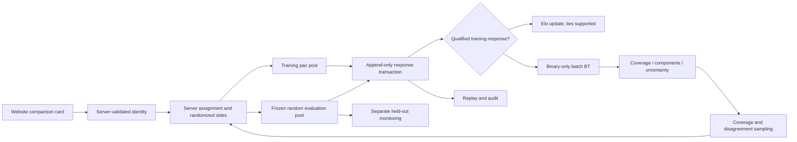

# Phase Six: comparison backend, community ratings and next steps

**Local engineering is implemented. Live voting is not deployed.** The real community database contains 0 events; no human votes were generated by the initialization workflow. Synthetic Phase Five scores remain separate.

## Full phase map



## Implemented plan

1. Freeze roster/features and create an append-only SQLite assignment/event store with transactional Elo.

2. Expose fail-closed authenticated WSGI comparison endpoints; pseudonymize subjects, bind responses to server assignments and enforce idempotency/rate limits.

3. Reserve a frozen random evaluation pair pool, exclude it from rating training and active sampling, randomize display side and record selection probabilities.

4. Implement reproducible Elo replay and regularized sum-zero batch Bradley–Terry; exclude ties/skips/non-dry/non-experienced/evaluation events from binary fits.

5. Select training pairs through random coverage plus component bridges, vote coverage, provisional-model disagreement and diversity; keep repeat-pair history.

6. Validate vote ownership, retries, tampering, transactional rollback, evaluation isolation, rating direction, connectivity and voter-bootstrap behavior.

7. Deliver API/entity contract, empty honest community snapshot, frozen-pool evidence, full phase map and deployment next steps.

## Deliverables and current evidence

- `outputs/block5_community.py`: SQLite store, Elo replay, batch BT/voter bootstrap, stochastic sampler and WSGI API factory.
- `tests/test_block5.py`: fixture votes remain in temporary databases; they are not human observations.
- `private_data/phase6/community.sqlite`: one real append-only event/assignment store; it does not copy the GPX/feature database.
- `private_data/phase6/community_snapshot.json`: current honest ratings/coverage and provenance.
- `outputs/phase6_review.json`: aggregate readiness and frozen evaluation-pool evidence.

Current roster: 100; events: 0; binary training responses: 0; connected components: 100; reserved evaluation pairs: 990.

With no votes, every route has neutral Elo 1500, zero vote counts, null BT estimates/intervals and no global community rank. Initial synthetic rankings are not presented as community evidence. The full graph initially has 100 isolated routes.

## API and event contract

| Endpoint | Behavior |
|---|---|
| GET /health | Service version |
| GET /v1/ratings | Ratings, counts, component/prior flags; no voter identifiers or event payloads |
| POST /v1/assignments | Authenticated server identity; empty request body; random left/right route card |
| POST /v1/comparisons | Authenticated assignment owner; idempotent response recording and atomic rating update |

Response body:

```json
{"event_id":"canonical UUID","assignment_id":"server UUID","choice":"left|right|tie|skip","completed_both":true,"conditions":"dry_summer|snow|mixed|unknown"}
```

Persisted events include server-normalized A/B/tie/skip outcome, canonical route IDs, roster hash, pseudonymous voter, assigned display side, lane/policy, exact selection probability, received timestamp, experience/conditions and payload hash. Unknown body fields, user-supplied identities/route IDs, expired/foreign assignments and duplicate answers are rejected. Equal event-ID retries return the original acceptance without another Elo update; conflicting retries return 409.

SQLite BEGIN IMMEDIATE makes event insert and both Elo changes one transaction. SQL triggers prevent event/assignment update or deletion. The server enforces per-pseudonym hourly limits and an 8 KiB request limit. Auth must be injected from a real server session verifier; the default rejects writes. HMAC pseudonymization requires a private 32-byte-or-longer key and does not retain plaintext account IDs. This is a tested API boundary, not a complete production identity provider or abuse-prevention service.

## Rating semantics and uncertainty

Larger community rating means harder. Elo starts at 1500 with K=24. Only training-lane, self-reported completed-both, dry-summer non-skip events update Elo; qualified ties use 0.5. Batch BT excludes ties and fits only qualified binary events, with sum-zero scores and L2=1. Each voter has equal total contribution in a batch. Snow/mixed/unknown-condition or inexperienced responses are recorded separately and do not silently affect the dry-summer ranking.

Elo replay is verified against stored ratings/counts. Batch BT reports connected components; component offsets are prior-driven when disconnected. Global ranks are withheld until connectivity, and readiness additionally requires at least five binary comparisons and two distinct voters per route. These counts are engineering pilot gates, not statistical guarantees.

Regularized curvature intervals are withheld for low-evidence routes and labeled prior-dependent; they ignore within-voter dependence. Voter-resampled BT intervals are available only with at least two voters, with 100 bootstrap resamples by default. They remain exploratory and sensitive to coverage, voter sampling and regularization. No intervals or rankings are fabricated for the empty store.

## Pair selection and evaluation isolation

A deterministic roster-frozen random 20% of all 4,950 pairs (990) is reserved for evaluation. That set is persisted with a checksum and cannot enter training Elo/BT or active acquisition. Twenty percent of assignments choose the evaluation lane when both pools have eligible pairs; its pair draw is uniform. Training selections mix 20% uniform probability with 80% weighted acquisition combining component bridges, low-vote coverage, regularized BT score-difference variance, Phase Five model disagreement, group diversity and repeat-count penalties.

Synthetic model disagreement is an initial heuristic acquisition signal, not measured epistemic uncertainty; it never initializes community ratings. The regularized score-difference variance is an approximate prior-sensitive uncertainty signal, not a validated posterior. A 0.5 expected outcome alone is not treated as uncertainty. Previously answered or outstanding pairs are excluded for that voter. Left/right order is uniformly random. Events retain the marginal lane × pair × side probability conditional on the current eligible history; exhausted-lane probabilities are renormalized.

The held-out lane evaluates comparisons among known routes, not generalization to unseen routes. Monitoring its metrics during development consumes confirmatory independence; freeze a model/checkpoint and time-separated evaluation stream before final claims. No propensity-corrected community accuracy is claimed in this local phase.

## GitHub connection

Authenticated Chrome GitHub access is verified on October 1, 2026. CLI API transport remains unavailable; no local Git remote is configured.

The user selected the existing public [ElliottGorsuch/14ers repository](https://github.com/ElliottGorsuch/14ers) for canonical code and documentation only, and Base44 hosting. Private tracks, cookies, derived per-route features/models and community records remain local.

## Base44 integration boundary

Base44 native backend functions use Deno and its request-derived client/session API. The current Python WSGI/SQLite core is a tested reference implementation, not a directly deployable Base44 function. Next-phase integration must port these contracts and atomic/idempotent semantics into supported Base44 backend storage, or connect a separately hosted Python service. Datastore transaction/concurrency behavior must be verified before live votes. [Official Base44 client/backend guide](https://docs.base44.com/sdk-getting-started/client).

## Next steps to finish live Phase Six and proceed to Phase Seven

1. Publish canonical code/docs to the selected GitHub repository; preserve private-data exclusions.
2. Implement the selected Base44 backend adapter or hosted Python bridge and attach a real authenticated session resolver, a private HMAC secret, HTTPS and deployment-level rate/concurrency controls.
3. Wire comparison cards to the assignment/response endpoints, including both-routes experience, conditions, tie/skip, accessible side order and retry handling.
4. Pilot with real completed-both dry-summer comparisons; inspect duplicates, coverage, component bridges, condition exclusions and voter concentration.
5. Schedule BT snapshots and audit replay; preserve the random evaluation lane and add a frozen time-separated evaluation checkpoint.
6. Proceed to the recorded Phase Seven graphs/clusters/hover/location/neighbor integration. Full-itinerary review and independent human evidence remain needed for final route-difficulty acceptance.

## Reproduction

```bash
python3 outputs/block5_community.py
python3 tests/test_block5.py
```

The CLI initializes/audits the real store and writes reports; it never opens a public port or fabricates votes. The WSGI factory is exercised in-process by tests, so no local-server network permission is needed.

References: [Bradley–Terry identifying constraints](https://arxiv.org/abs/2205.04341), [BT uncertainty study](https://academic.oup.com/imaiai/article/12/2/1073/7017369), [OWASP REST security](https://cheatsheetseries.owasp.org/cheatsheets/REST_Security_Cheat_Sheet.html).
